# [02-NARRATIVE-SYSTEM.md]

*Architected by the Principal Product Strategy Council. Built upon the foundation of [01-BEHAVIORAL-STRATEGY.md]. This document serves as the absolute, high-fidelity source of truth for all product, engineering, and design decisions.*

---

## 1. Product Narrative Framework (Deep Architecture)

The narrative is the invisible architecture that holds the product together. If the engineering is the skeleton, the narrative is the soul.

### The Core Story: The War on Waste & Isolation
**The Villain:** The "Throw-away Culture" and the "Transactional Web." The modern reality where it is easier to throw a usable crib into a landfill than to find a neighbor who needs it. The villain is also the anxiety of dealing with anonymous scammers on classified sites.
**The Magic Object:** The "Verified ThankU Profile"—a digital passport of kindness and reliability that instantly disarms fear.
**The Quest:** To build a localized, decentralized ecosystem where goods flow freely to those who need them, governed not by money, but by a transparent ledger of gratitude.

### The Heroic Ecosystem
Unlike traditional apps, there is no single hero. ThankU relies on a symbiotic trinity:
1.  **The Catalyst (The Donor):** They initiate the cycle. They hold dormant capital (unused goods) and release it. *Core Need:* Convenience and Virtue.
2.  **The Closer (The Recipient):** They complete the cycle. They capture the dormant capital, preventing it from becoming waste. *Core Need:* Dignity and Utility.
3.  **The Witness (The Community):** They validate the cycle. By reading the Gratitude Wall and viewing leaderboards, they provide the social proof required to normalize the behavior. *Core Need:* Hope and Inspiration.

### The Transformation Arc
*   **Status Quo (Before):** "My garage is full of things I feel guilty throwing away. But selling them online is a nightmare of haggling and creepy messages."
*   **The Catalyst (Discovery):** "I see my neighbor saved 50kg of waste on ThankU. Let me try."
*   **The Climax (The Handover):** "I left the item on my porch. The recipient picked it up perfectly on time."
*   **The Resolution (After):** "They left me a beautiful public note. I feel amazing. I'm going to look for more things to give away tomorrow."

---

## 2. Product Experience Principles (React Native Translation)

Every philosophical principle must map directly to an engineering or UX standard.

### 1. Radical Simplicity
*   **Philosophy:** Eliminating cognitive friction.
*   **Product Implication:** No open-chat negotiation for meeting times. 
*   **React Native Standard:** The "Schedule Pickup" feature MUST be a Native Bottom Sheet containing a pre-populated Calendar component and 3 discrete time-blocks (Morning, Afternoon, Evening). *Zero keyboard entry allowed for scheduling.*

### 2. High-Fidelity Trust
*   **Philosophy:** Safety through forced transparency.
*   **Product Implication:** Anonymity is banned. 
*   **React Native Standard:** Phone numbers are never exposed. All communication uses secure WebSockets within the app. Avatars must be clearly visible. A "Shield" SVG badge must accompany verified profiles globally across all list-views.

### 3. Community Elevation
*   **Philosophy:** Transactions are forgettable; community ties are sticky.
*   **Product Implication:** The "Gratitude Wall" is treated with the same UX priority as the "Home Feed."
*   **React Native Standard:** Implement a sticky "Applaud" floating animation (similar to Instagram Live hearts) when users interact with Gratitude Notes to create immediate dopamine feedback.

### 4. Quantifiable Sustainability
*   **Philosophy:** Abstract environmentalism fails. Concrete metrics win.
*   **Product Implication:** The Impact Dashboard.
*   **React Native Standard:** Use Reanimated to create fluid, counting-up animations (e.g., `0` rapidly rolling up to `124 kg`) every time the user opens the dashboard, reinforcing the feeling of accumulation.

### 5. Emotional Dignity
*   **Philosophy:** "Charity" implies a power imbalance. ThankU is a premium exchange.
*   **Product Implication:** Aesthetic choices.
*   **React Native Standard:** Strict prohibition of harsh alert reds (`#FF0000`). Error states use calm oranges or deep purples. Typography must be a premium sans-serif (e.g., Inter or SF Pro) with high line-height to create breathing room.

---

## 3. Master User Journeys & State Machines

### Journey 1: The Donor (Creation to Completion)
**State Machine:** `DRAFT` → `ACTIVE` → `REQUESTED` → `PENDING_APPROVAL` → `SCHEDULED` → `COMPLETED`
*   **Step 1: The Capture (`DRAFT` → `ACTIVE`)**
    *   *Action:* User opens camera, takes photo. AI auto-detects "Wooden Chair."
    *   *Friction Removal:* No price field. Condition is a 1-tap pill (New, Good, Fair). 
    *   *Transportation Tag:* Mandatory selection (e.g., "Fits in a Sedan," "Needs a Truck") to prevent logistical embarrassment at pickup.
    *   *UX Detail:* A soft haptic *thud* when the "Post" button is pressed.
*   **Step 2: The Evaluation (`REQUESTED`)**
    *   *Action:* User receives 3 requests. They read the 200-character "Why I need this" field for each.
    *   *Psychology:* This is the emotional anchor. The donor is playing god/benefactor.
*   **Step 3: The Coordination (`PENDING_APPROVAL` → `SCHEDULED`)**
    *   *Action:* Donor selects Recipient A. App prompts donor to select 3 available time slots.
*   **Step 4: The Handover (`COMPLETED`)**
    *   *Action:* Geofencing detects users are near, or manual "Item Exchanged" button is pressed.
*   **Edge Case / Failure State (Ghosting Recovery Flow):** Recipient no-shows. Donor taps "Report No-Show." The app instantly auto-drafts the item back to the active feed, penalizes Recipient A, and sends the Donor an empathetic apology with an automatic boost to their profile's algorithm visibility to compensate for wasted time.

### Journey 2: The Recipient (Discovery to Gratitude)
**State Machine:** `BROWSING` → `REQUEST_SENT` → `APPROVED` → `IN_TRANSIT` → `RECEIVED`
*   **Step 1: The Request (`REQUEST_SENT`)**
    *   *Action:* Finds a chair. Taps "Request." 
    *   *Friction Addition (Intentional):* Must type at least 50 characters explaining why they want it. Filters out bots/resellers.
*   **Step 2: The Confirmation (`APPROVED`)**
    *   *Action:* Push notification: "You were chosen for the Wooden Chair!"
    *   *UX Detail:* Confetti animation on screen open.
*   **Step 3: The Logistics (`IN_TRANSIT`)**
    *   *Action:* Recipient selects one of the 3 time slots the Donor provided. The exact address is finally revealed.
*   **Step 4: The Restoration of Equity (`RECEIVED`)**
    *   *Action:* 2 hours post-pickup, app locks the home feed with a soft modal: "How do you like the chair? Take 30 seconds to thank [Donor Name]."
    *   *Psychology:* Forces the Gratitude loop, ensuring the platform's emotional engine stays fueled.

---

## 4. Complete Information Architecture (React Navigation Tree)

```mermaid
graph TD
    Root[App Root] --> Auth[Auth Stack]
    Root --> Main[Main Bottom Tabs]
    
    Auth --> Onboarding[Onboarding Carousel]
    Auth --> PhoneVerify[Phone Verification]
    Auth --> CommunityPledge[The Community Pledge]
    
    Main --> Home[Home Stack]
    Main --> Community[Community Stack]
    Main --> Post[Post Item Modal]
    Main --> Messages[Messages Stack]
    Main --> Profile[Profile Stack]
    
    Home --> Feed[Local Feed]
    Home --> ItemDetails[Item Details View]
    Home --> RequestModal[Request Item Bottom Sheet]
    
    Community --> GratitudeWall[Gratitude Wall]
    Community --> Leaderboard[Local Leaders]
    Community --> ImpactMilestones[Neighborhood Impact]
    
    Messages --> Inbox[Active Requests & Chats]
    Messages --> ChatThread[Secure Messaging]
    Messages --> CoordinationUI[Pickup Coordination Overlay]
    
    Profile --> ImpactDash[Impact Analytics Dashboard]
    Profile --> TrustCenter[Verification & Safety Hub]
    Profile --> MyListings[Active & Past Donations]
    Profile --> Settings[Account Settings]
```

---

## 5. Granular Screen Inventory & Feature Matrix

### 5.1. The Home Feed (Discovery Engine)
*   **Data Needed:** Paginated feed of `Items` (Photos, Titles, Condition, Distance).
*   **Primary User State:** Passive browsing, seeking utility.
*   **Transition In:** Fade in with staggered skeleton loaders.
*   **Empty State:** "Your neighborhood is quiet today. Be the spark." + SVG of a watering can.
*   **UX Constraint:** Infinite scroll. High-performance FastImage caching required. Images must span full width to emphasize visual quality over text.

### 5.2. Item Details
*   **Data Needed:** `Item ID`, `Donor Profile` (Avatar, Verification Badge, Rating), `Description`, `Why Giving Away`.
*   **Primary CTA:** Large, sticky bottom button: "Request This Item."
*   **Trust Anchors:** "Donor usually responds in < 1 hour" and "Verified Phone."

### 5.3. Request Item (The Friction Filter)
*   **Component Type:** Bottom Sheet Modal.
*   **Data Needed:** Text area for "Why do you need this?" (Max 300 chars).
*   **Psychological Goal:** Force the user to humanize themselves.
*   **Failure State:** Submit button disabled until 50 characters are typed.

### 5.4. Pickup Coordination (State Machine UI)
*   **Component Type:** Full-screen overlay within the Message Thread.
*   **View for Donor:** Select 3 time slots from a rolling 7-day calendar.
*   **View for Recipient:** Tap 1 of the 3 slots to confirm.
*   **Once Confirmed:** UI transforms into a "Ticket" showing Date, Time, and Exact Map Location. Open-chat unlocks for final "I am outside" messages.

### 5.5. The Gratitude Wall
*   **Data Needed:** Feed of `ThankU Notes` (Recipient Name, Donor Name, Item Tag, Note Text).
*   **Interaction:** "Applaud" button (triggers floating haptic hearts).
*   **Emotional Goal:** Induce sympathetic joy and validate the platform's safety.

### 5.6. The Impact Dashboard
*   **Data Needed:** Aggregated user metrics (`ItemsDonated`, `KgWasteSaved`, `TreesPreserved`, `Co2Reduced`).
*   **Visuals:** Large data visualization charts (Victory Native or Reanimated graphs).
*   **Shareability:** A prominent "Share to Instagram Story" button that generates a beautiful, branded image card of their impact.

### 5.7. The Trust Center
*   **Visual Metaphor:** A digital passport.
*   **Levels:** 
    *   Level 1: Phone Verified (Required).
    *   Level 2: Email Verified.
    *   Level 3: Identity Verified (Unlocks the Blue Shield).
*   **Community Score Display:** Shown out of 5.0, with a breakdown (Communication: 4.9, Reliability: 5.0, Item Accuracy: 4.8).
*   **App Store Compliance (UGC):** Mandatory "Report User" and "Block User" flows prominently accessible to maintain a pristine ecosystem.

---

## 6. Emotional Journey Mapping & Neurochemistry

We are engineering emotional states to drive retention.

| Feature / Interaction | Target Emotion | Neurochemical Trigger | UX Execution |
| :--- | :--- | :--- | :--- |
| **Browsing high-quality free items** | Anticipation | Dopamine (Seeking) | Pinterest-style masonry grid, emphasis on imagery over text. |
| **Reading "Why I need this" requests** | Empathy | Oxytocin (Connection) | Display the recipient's avatar next to their story. Use elegant serif typography for quotes. |
| **Completing the Coordination Calendar**| Certainty | Cortisol Reduction (Stress relief) | Remove all open text. Use large, satisfying toggle buttons for time slots. |
| **Receiving a ThankU Note** | Validation & Joy | Serotonin (Status/Pride) | Trigger a full-screen notification. "Priya left you a note." Delay revealing the text by 1 second to build suspense. |
| **Viewing Impact Dashboard** | Purpose | Endorphins (Achievement) | Animate the numbers rolling up. Play a subtle ascending chime sound. |

---

## 7. Content & Copywriting Architecture (The Voice of ThankU)

The copy must sound like a helpful, intelligent, and warm concierge. 

### The "Instead of This, Say This" Dictionary
*   *Instead of:* "Buy / Sell" → *Say:* "Request / Donate"
*   *Instead of:* "Transaction" → *Say:* "Exchange"
*   *Instead of:* "Customer" → *Say:* "Neighbor"
*   *Instead of:* "Error 404" → *Say:* "Looks like this item already found a home."
*   *Instead of:* "Submit" → *Say:* "Send Request"
*   *Instead of:* "Delete Account" → *Say:* "Leave the Community"
*   *Instead of:* "Rate User" → *Say:* "Share Your Experience"

### Push Notification Matrix
*   **Trigger: Request Received.** *Copy:* "Someone needs your chair! Tap to read their story."
*   **Trigger: Request Approved.** *Copy:* "Great news! Priya chose you for the Wooden Chair."
*   **Trigger: Pickup Reminder.** *Copy:* "Pickup today at 4 PM. Priya is waiting for you."
*   **Trigger: Post-Pickup Gratitude.** *Copy:* "How is the new chair? Take a moment to say thanks to Priya."
*   **Trigger: End of Month Impact.** *Copy:* "You saved 4 trees this month. See your neighborhood impact."

---

## 8. Deep Trust & Moderation Algorithm Design

### The "Community Score" Mechanics
Trust cannot be easily gamed. The score is a weighted algorithm, not a simple average.
*   **Baseline:** All new users start at 5.0.
*   **Positive Weights:** 
    *   Successful handover (+10 points)
    *   Receiving a ThankU Note (+5 points)
    *   Responding to requests in < 2 hours (+2 points)
*   **Negative Weights (Severe):**
    *   No-Show / Ghosting at pickup (-50 points). *A single no-show devastates a profile.*
    *   Item condition vastly misrepresented (-20 points).
    *   Aggressive language in chat (-100 points, auto-flag for ban).

### The "Flake Protection" System
If a Recipient confirms a pickup time and does not show up, the Donor taps a single button: "Recipient did not arrive." 
1. The item immediately relists.
2. The Recipient is temporarily blocked from requesting new items for 7 days (The "Cooling Off" period).
3. This creates a high-stakes environment where people honor their commitments.

---

## 9. Success States & Micro-Interactions

*   **The "Item Posted" Success:** 
    *   *Visual:* A 3D box packing itself. 
    *   *Haptic:* `ImpactFeedbackStyle.Heavy`.
    *   *Copy:* "Your item is live. You're awesome."
*   **The "Match Made" Success:** 
    *   *Visual:* The Donor's avatar and the Recipient's avatar sliding together with a handshake or heart icon bridging them. 
    *   *Haptic:* `NotificationFeedbackType.Success`.
*   **The "Gratitude Sent" Success:** 
    *   *Visual:* The ThankU note visually folding into an envelope and flying up the screen.

---

## 10. Empty States (High-Value Real Estate)

Empty states are the highest risk for churn. They must be beautiful.

1.  **Empty Inbox (Messages):** 
    *   *SVG:* A peaceful mailbox with a bird on it. 
    *   *Copy:* "Your inbox is peaceful. Once you request or donate an item, the magic happens here."
2.  **Empty Impact Dashboard:** 
    *   *SVG:* A single seed in soil. 
    *   *Copy:* "Every forest starts with a seed. Post your first item to start tracking your environmental impact."
3.  **No Search Results:** 
    *   *SVG:* A magnifying glass looking at a pair of socks. 
    *   *Copy:* "We couldn't find a 'vintage typewriter' nearby. But neighbors post new things daily. Check back tomorrow!"

---

## 11. Future Ecosystem Architecture (Data Readiness)

To ensure the backend doesn't need a rewrite in Year 2, the data models must support these future verticals *now*:

### 1. The NGO Integration (V2)
*   **Concept:** Verified charities can create "Needs Lists."
*   **Data Implication:** The `Item` schema must support a `RequestType` enum (`OFFER`, `WANTED`). The `User` schema must support an `AccountType` enum (`INDIVIDUAL`, `VERIFIED_NGO`).

### 2. Community Drives (V2.5)
*   **Concept:** Time-boxed campaigns (e.g., "Chennai Flood Relief").
*   **Data Implication:** Implement a `CampaignId` relationship on the `Item` model, allowing donations to be aggregated under a specific event for specialized leaderboards.

### 3. Hyper-Local Sub-Networks (V3)
*   **Concept:** "Gated" communities (e.g., "Only show my items to people who live in my apartment complex").
*   **Data Implication:** The `User` model must support many-to-many `Communities` or `Tribes` relationships with access-control logic on the read feeds.

### 4. Item Lineage: The Ripple Effect (V3.5)
*   **Concept:** Tracking an item over its lifetime. If someone donates a chair, and two years later that recipient donates it again on ThankU, the original donor gets a notification.
*   **Data Implication:** A persistent `ItemPassportId` that survives across multiple transfer instances, creating a genealogical tree of generosity.

---

**FINAL MANDATE FOR ENGINEERING & DESIGN:**
If an interaction does not build trust, simplify coordination, or generate gratitude, it does not belong in this application. Stick to this architecture relentlessly.
